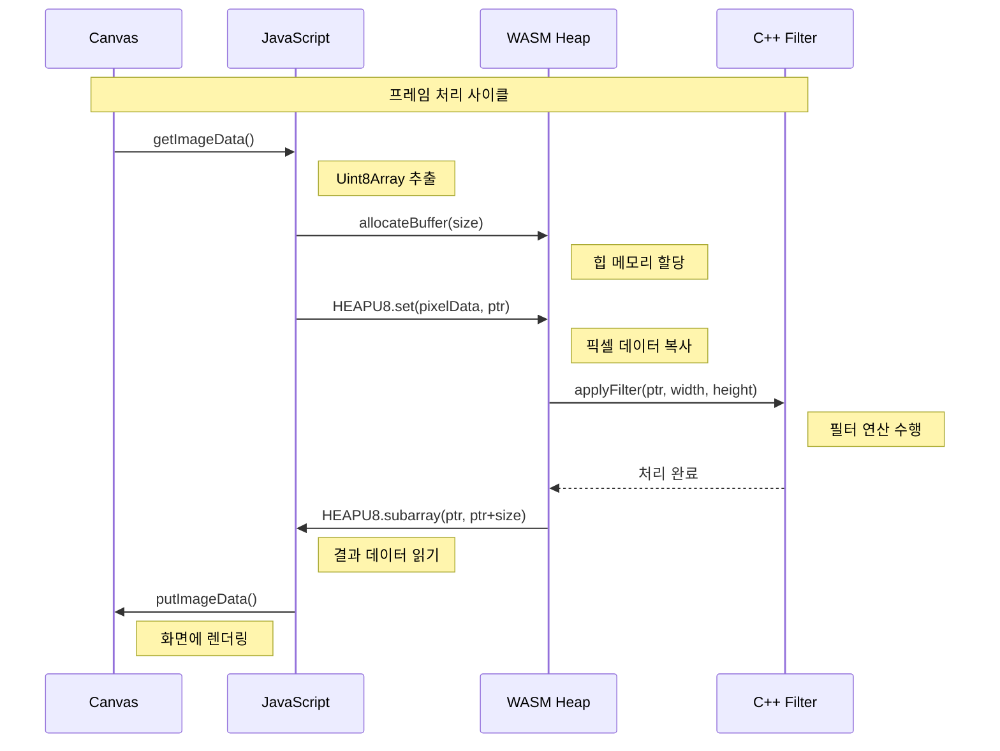

# 8조 - WebCam Filter WASM

## 팀 정보

| 역할 | 이름 |
|------|------|
| 팀장 | 강성준 |
| 팀원 | 방채민 |
| 팀원 | 손아영 |

---

## 프로젝트 개요

WebAssembly를 활용한 실시간 웹캠 필터 애플리케이션

C++로 작성된 이미지 처리 알고리즘을 WebAssembly로 컴파일하여 브라우저에서 실시간 필터를 적용합니다.

### 주요 기능

- **6가지 필터**: Grayscale, Sepia, X-Ray, Mirror, Chroma Key, Thermal
- **실시간 처리**: 60 FPS 웹캠 영상에 필터 적용
- **크로마키**: 배경 이미지 합성 기능
- **성능 모니터링**: 처리 시간 및 FPS 실시간 표시

---

## 실행 방법

```bash
# 1. Emscripten 환경 활성화
cd emsdk && source ./emsdk_env.sh && cd ..

# 2. 빌드
./build.sh

# 3. 서버 실행
./serve.sh

# 4. 브라우저에서 접속
# http://localhost:8080
```

---

## 역할 분담

| 이름 | 담당 업무                                |
|------|--------------------------------------|
| 강성준 | 크로마키, 열화상 필터 구현                      |
| 손아영 | 세피아, 엑스레이 필터 구현                      |
| 방채민 | 프로젝트 초기 세팅, JS↔WASM 연동, 흑백, 거울 필터 구현 |

---

## 코드 설명

### 손아영 - 세피아, X-Ray 필터

**세피아 필터**
- 이미지 메모리 주소를 받아 픽셀 단위로 반복 처리
- RGB 값을 읽고 정수 연산으로 세피아 공식 적용
- 클램핑 후 8비트 데이터로 변환하여 원래 위치에 덮어쓰기

**X-Ray 필터**
- 명암 반전(`255 - 원래값`)과 대비 증강 조합
- 픽셀 밝기 차이를 극대화하여 X-Ray 투과 효과 구현
- 0~255 범위로 클램핑 후 메모리에 저장

### 강성준 - 크로마키, 열화상 필터

**크로마키 필터**
- RGB 3차원 공간의 거리 공식으로 기준 색상과의 유사도 판단
- `sqrt()` 대신 제곱값 비교로 성능 최적화: `distSq <= tolSq`
- 허용 범위 내 픽셀을 배경 이미지로 대체

**열화상 필터**
- 밝기를 색상으로 시각화하여 열화상 카메라 효과 구현
- 녹색 채널에 높은 가중치 + 비트 연산으로 밝기 계산 최적화
- 6단계 그라데이션 매핑: 어두움(파랑) → 밝음(빨강/흰색)

### 방채민 - JS↔WASM 연동



- `getImageData()`로 Canvas에서 픽셀 데이터(Uint8Array) 추출
- `allocateBuffer()`로 WASM 힙에 버퍼 할당
- `HEAPU8.set()`으로 JavaScript 배열을 WASM 메모리에 복사
- C++ 함수 처리 후 `HEAPU8.subarray()`로 결과 읽기
- embind를 사용하여 C++ 함수를 JavaScript에서 직접 호출 가능하게 함

---

## 어려웠던 점과 해결 방법

### 강성준
- **어려움**: 크로마키 성능 최적화
  - 실시간 처리 시 매 프레임 수십만 개의 픽셀을 검사해야 함
  - 이로 인해 프레임 저하 발생
- **해결**: 수학 연산 최적화
  - 무거운 연산(sqrt 등)을 단순 비교 연산과 비트 연산으로 대체
  - 결과적으로 웹 브라우저에서도 끊김 없는 성능 확보

### 손아영
- **어려움**: 프로젝트 파일의 모듈화(다수 파일 분할)와 정수 연산 최적화, 비트 연산 등 생소한 개념이 많아 어려움을 겪었음

- **해결**: 팀원들의 도움과 관련 자료 학습을 통해, 필터 기능을 구현함.

### 방채민
- **어려움**: Emscripten 환경 설정 및 메모리 연동
  - C++ 빌드 환경이 낯설고 emsdk 설치/활성화 과정이 복잡함
  - JS의 ImageData를 C++ 포인터로 전달하는 방식 이해가 어려움
- **해결**: 문서 참고 및 도구 활용
  - 공식 문서를 따라 단계별 설정, 빌드 스크립트로 자동화
  - HEAPU8 버퍼와 embind를 활용하여 메모리 직접 접근 구현

---

## 가산점 항목

### 추가 기능 구현
- **6가지 필터**: 기본 요구사항 외에 Grayscale, Sepia, X-Ray, Mirror, Chroma Key, Thermal 필터 구현
- **크로마키 시스템**: 색상 선택, 허용 범위 조절(10~150), 배경 이미지 업로드 지원
- **실시간 성능 모니터링**: 처리 시간(ms), FPS 표시, 색상 코딩(초록/파랑/노랑/빨강)으로 성능 상태 시각화

---

## Latency 측정

### 테스트 환경
- 해상도: 640 × 480
- 브라우저: Chrome
- 측정: 50회 평균 (`runBenchmark(50)`)

### C++ (WASM) vs JavaScript 성능 비교

| 필터 | C++ (WASM) | JavaScript | 성능 향상 |
|------|------------|------------|----------|
| Grayscale | 0.34ms | 0.48ms | **1.4x** |
| Sepia | 0.26ms | 0.75ms | **2.9x** |
| X-Ray | 0.50ms | 0.76ms | **1.5x** |
| Mirror | 0.30ms | 0.49ms | **1.6x** |
| Thermal | 0.65ms | 0.80ms | **1.2x** |

**→ 모든 필터에서 C++/WASM이 JavaScript보다 1.2x ~ 2.9x 빠름**
